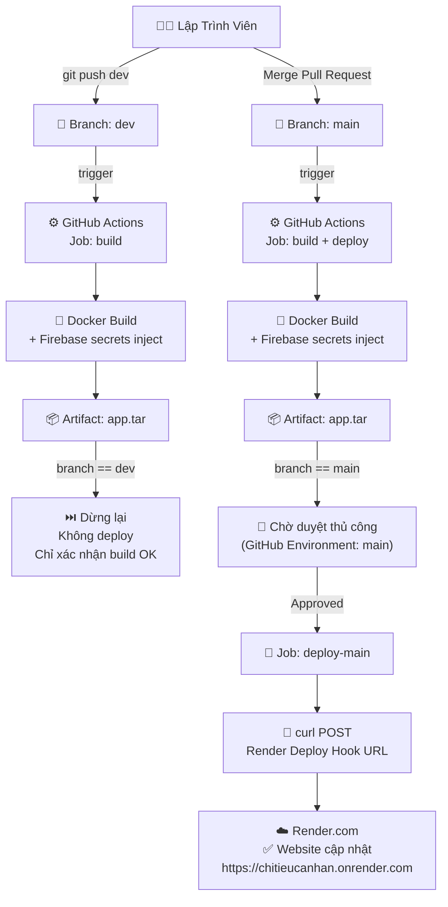

# Đề Tài 7: Xây Dựng Quy Trình CI/CD Pipeline

> **Tự động hóa quy trình phát triển phần mềm** — Từ lúc lập trình viên đẩy code đến lúc ứng dụng được cập nhật trên môi trường Production mà không cần can thiệp thủ công.

---

## 📋 Mục Lục

- [Mô Tả Đề Tài](#-mô-tả-đề-tài)
- [Công Nghệ Sử Dụng](#-công-nghệ-sử-dụng)
- [Kiến Trúc Tổng Thể](#-kiến-trúc-tổng-thể)
- [Cấu Trúc Thư Mục](#-cấu-trúc-thư-mục)
- [Yêu Cầu Hệ Thống](#-yêu-cầu-hệ-thống)
- [Hướng Dẫn Cài Đặt](#-hướng-dẫn-cài-đặt)
- [Cấu Hình GitHub Secrets](#-cấu-hình-github-secrets)
- [Cấu Hình GitHub Environments](#-cấu-hình-github-environments)
- [Luồng CI/CD Pipeline](#-luồng-cicd-pipeline)
- [Chiến Lược Nhánh](#-chiến-lược-nhánh)
- [Phân Tích Dockerfile](#-phân-tích-dockerfile)
- [Kịch Bản Demo](#-kịch-bản-demo)
- [Đánh Giá Yêu Cầu Kỹ Thuật](#-đánh-giá-yêu-cầu-kỹ-thuật)

---

## 📖 Mô Tả Đề Tài

Đề tài xây dựng một quy trình CI/CD (Continuous Integration / Continuous Deployment) hoàn chỉnh cho ứng dụng web **Quản Lý Chi Tiêu Cá Nhân** (Next.js). Pipeline tự động hóa toàn bộ các bước:

- **Source** → Lập trình viên push code lên GitHub
- **Build** → GitHub Actions tự động build Docker image
- **Test** → Kiểm tra chất lượng code (lint)
- **Deploy** → Tự động triển khai lên môi trường Production (Render.com)

**Mục tiêu:** Sau mỗi lần push code hợp lệ lên nhánh `main` và được **phê duyệt thủ công**, ứng dụng trên Production sẽ tự động được cập nhật trong vòng 5–10 phút.

---

## 🛠️ Công Nghệ Sử Dụng

| Hạng Mục             | Công Nghệ                   | Ghi Chú                          |
| -------------------- | --------------------------- | -------------------------------- |
| **Ứng Dụng**         | Next.js 16 (App Router)     | Framework React production-ready |
| **Ngôn Ngữ**         | TypeScript                  | Strict typing                    |
| **Styling**          | Tailwind CSS v4             | Utility-first CSS                |
| **Backend / Auth**   | Firebase (Auth + Firestore) | BaaS — không cần backend riêng   |
| **Containerization** | Docker (Multi-stage Build)  | Đóng gói ứng dụng                |
| **Source Control**   | GitHub                      | Quản lý mã nguồn                 |
| **CI/CD**            | GitHub Actions              | Tự động hóa pipeline             |
| **Target / Server**  | Render.com                  | PaaS — deploy qua Deploy Hook    |
| **Package Manager**  | pnpm                        | Nhanh hơn npm/yarn               |

---

## 🏗️ Kiến Trúc Tổng Thể



---

## 📁 Cấu Trúc Thư Mục

```text
chitieucanhan/
├── .github/
│   └── workflows/
│       └── ci-cd.yml          # GitHub Actions workflow chính
│
├── app/                       # Next.js App Router
│   ├── (auth)/                # Trang login, register, forgot-password
│   └── dashboard/             # Dashboard chính (expenses, savings, ...)
│
├── components/                # React components
│   ├── ui/                    # shadcn/ui primitives
│   └── ...                    # Feature components
│
├── services/                  # Business logic + Firebase queries
├── hooks/                     # Custom React hooks
├── lib/
│   └── firebase.ts            # Firebase khởi tạo duy nhất
│
├── Dockerfile                 # Multi-stage Docker build
├── .dockerignore              # File loại trừ khỏi Docker context
├── .env.example               # Mẫu biến môi trường
├── package.json
└── pnpm-lock.yaml
```

---

## 💻 Yêu Cầu Hệ Thống

### Máy Lập Trình Viên (Local)

| Công Cụ        | Phiên Bản Tối Thiểu  |
| -------------- | -------------------- |
| Node.js        | 20+                  |
| pnpm           | 9+                   |
| Git            | 2.x                  |
| Docker Desktop | 24+ (nếu test local) |

### Render.com (Production)

| Yêu Cầu | Ghi Chú |
| ------- | ------- |
| Tài khoản Render.com | Đăng ký tại [render.com](https://render.com) |
| Service đã connect GitHub | Kết nối repo `chitieucanhan` |
| Auto-Deploy | **Tắt** (để Approval có hiệu lực) |
| Deploy Hook URL | Lấy tại Settings → Deploy Hook |

---

## 🚀 Hướng Dẫn Cài Đặt

### 1. Clone Repository

```bash
git clone https://github.com/phanvantien2907/chitieucanhan.git
cd chitieucanhan
```

### 2. Cài Đặt Dependencies

```bash
pnpm install
```

### 3. Cấu Hình Biến Môi Trường

Tạo file `.env.local` từ file mẫu:

```bash
cp .env.example .env.local
```

Điền các giá trị thực từ **Firebase Console** vào `.env.local`:

```env
NEXT_PUBLIC_FIREBASE_API_KEY=your_api_key
NEXT_PUBLIC_FIREBASE_AUTH_DOMAIN=your_project.firebaseapp.com
NEXT_PUBLIC_FIREBASE_PROJECT_ID=your_project_id
NEXT_PUBLIC_FIREBASE_STORAGE_BUCKET=your_project.appspot.com
NEXT_PUBLIC_FIREBASE_MESSAGING_SENDER_ID=your_sender_id
NEXT_PUBLIC_FIREBASE_APP_ID=your_app_id
```

> ⚠️ **Lưu ý:** Không commit file `.env.local` lên GitHub. File này đã được thêm vào `.gitignore`.

### 4. Chạy Môi Trường Development

```bash
pnpm dev
```

Mở trình duyệt tại: [http://localhost:3000](http://localhost:3000)

### 5. Build Production (Local Test)

```bash
pnpm build
pnpm start
```

### 6. Build và Chạy Docker Local (Dùng Docker Compose)

Thay vì gõ tay từng `--build-arg`, dùng `docker-compose.yml` để tự động đọc giá trị từ file `.env`:

```bash
# Build image + khởi chạy container (1 lệnh duy nhất)
docker compose up --build

# Hoặc chỉ build image (không chạy)
docker compose build

# Chạy container từ image đã build (không build lại)
docker compose up

# Dừng container
docker compose down
```

Mở trình duyệt tại: [http://localhost:3000](http://localhost:3000)

> ✅ **`docker compose up --build`** tự đọc file `.env` ở root project và truyền các giá trị Firebase vào Docker build-args — không cần hardcode bất cứ thứ gì.
>
> 🐳 Image sau khi build sẽ có tên `chitieucanhan-local`, container sẽ có tên `chitieucanhan-local`.

---

## 🔐 Cấu Hình GitHub Secrets

Truy cập: **GitHub Repo → Settings → Secrets and variables → Actions → New repository secret**

| Tên Secret                     | Giá Trị                           | Dùng Ở Đâu        |
| ------------------------------ | --------------------------------- | ----------------- |
| `FIREBASE_API_KEY`             | Firebase API Key                  | Build             |
| `FIREBASE_AUTH_DOMAIN`         | Firebase Auth Domain              | Build             |
| `FIREBASE_PROJECT_ID`          | Firebase Project ID               | Build             |
| `FIREBASE_STORAGE_BUCKET`      | Firebase Storage Bucket           | Build             |
| `FIREBASE_MESSAGING_SENDER_ID` | Firebase Sender ID                | Build             |
| `FIREBASE_APP_ID`              | Firebase App ID                   | Build             |
| `RENDER_DEPLOY_HOOK_URL`       | URL Deploy Hook từ Render Dashboard | Deploy Production |

> 💡 **Lấy Deploy Hook URL:** Render Dashboard → Service → Settings → Deploy Hook → Copy URL.

---

## 🌍 Cấu Hình GitHub Environments

### Tạo Environment `main` (Production)

Truy cập: **GitHub Repo → Settings → Environments → New environment**

1. Đặt tên: `main`
2. Bật **"Required reviewers"** → Thêm người phê duyệt
3. Tùy chọn: Bật **"Wait timer"** (ví dụ 5 phút) trước khi deploy

> ✅ Khi bật Required reviewers, pipeline sẽ **dừng và chờ phê duyệt thủ công** trước khi deploy lên Production — đáp ứng yêu cầu **Manual Approval**.

---

## 🔄 Luồng CI/CD Pipeline

### Sơ Đồ Các Bước

```
┌─────────────────────────────────────────────────────────────────────┐
│                     GITHUB ACTIONS WORKFLOW                         │
│                                                                     │
│  push dev / push main                                               │
│         │                                                           │
│         ▼                                                           │
│  ┌─────────────────────────────────────────┐                        │
│  │             JOB: build                  │                        │
│  │  1. Checkout code                       │                        │
│  │  2. Setup Docker Buildx                 │                        │
│  │  3. Docker build (3-stage)              │  ← inject secrets      │
│  │  4. docker save → app.tar               │                        │
│  │  5. Upload artifact (app.tar)           │                        │
│  └────────────────┬────────────────────────┘                        │
│                   │                                                 │
│         ┌─────────┴──────────┐                                      │
│         │                    │                                      │
│  branch == dev        branch == main                                │
│         │                    │                                      │
│         ▼                    ▼                                      │
│    ✅ Dừng lại    ┌──────────────────────────┐                      │
│  (Build OK là đủ) │    JOB: deploy-main      │                      │
│                   │  👤 Chờ duyệt thủ công  │                      │
│                   │  (environment: main)     │                      │
│                   │                          │                      │
│                   │  6. curl POST Deploy Hook│                      │
│                   │     → Render.com deploy  │                      │
│                   └──────────────────────────┘                      │
└─────────────────────────────────────────────────────────────────────┘
```

### Chi Tiết Từng Bước

#### **Bước 1: Checkout Code**

```yaml
- uses: actions/checkout@v4
```

GitHub Actions clone toàn bộ source code từ repository vào máy chủ runner (ubuntu-latest).

#### **Bước 2: Setup Docker Buildx**

```yaml
- uses: docker/setup-buildx-action@v3
```

Cài đặt Docker Buildx — công cụ build Docker nâng cao, hỗ trợ multi-platform và cache layer.

#### **Bước 3: Build Docker Image**

```yaml
- run: docker build --build-arg NEXT_PUBLIC_FIREBASE_API_KEY=${{ secrets.FIREBASE_API_KEY }} ... -t my-nextjs-app:latest .
```

Build Docker image với 3 stage (xem chi tiết ở mục Dockerfile). Các Firebase secrets được truyền vào lúc build để Next.js nhúng vào JS bundle.

#### **Bước 4: Export Image**

```yaml
- run: docker save my-nextjs-app:latest > app.tar
```

Xuất toàn bộ Docker image thành file `app.tar` để có thể chuyển sang EC2.

#### **Bước 5: Upload Artifact**

```yaml
- uses: actions/upload-artifact@v4
  with:
    name: docker-image
    path: app.tar
```

Lưu `app.tar` lên GitHub Artifact Storage. Job `deploy-main` sẽ tải về từ đây.

#### **Bước 6: Trigger Render Deploy Hook** _(chỉ branch main, sau khi được duyệt)_

```yaml
- name: Trigger Render Deploy Hook
  run: |
    curl -fsSL -X POST "${{ secrets.RENDER_DEPLOY_HOOK_URL }}"
    echo "✅ Đã gửi lệnh deploy lên Render.com!"
```

Sau khi được **Approve**, bước này gửi HTTP POST tới Render Deploy Hook. Render nhận tín hiệu và tự động build + deploy phiên bản mới.

> 🔒 **Tại sao không dùng Auto-Deploy của Render?**
> Nếu Render tự detect push lên `main`, nó sẽ deploy **bỏ qua Approval**. Bằng cách tắt Auto-Deploy và chỉ trigger qua Hook sau khi được duyệt, mọi deploy đều có người kiểm soat.

---

## 🌿 Chiến Lược Nhánh

```
main ──────────────────●──────────────────●──────────── (Production)
                       ↑                  ↑
                    Merge PR           Merge PR
                       │                  │
dev  ──●──●──●─────────●──●──●──●─────────●──────────── (Development)
       │  │  │            │  │  │
     feat feat fix      feat feat fix
```

| Nhánh  | Vai Trò                        | Trigger Pipeline                | Kết Quả                   |
| ------ | ------------------------------ | ------------------------------- | ------------------------- |
| `dev`  | Phát triển tính năng           | ✅ Chạy job `build`             | Xác nhận code compile OK  |
| `main` | Code ổn định, production-ready | ✅ Chạy `build` + `deploy-main` | Deploy lên Render.com (sau khi duyệt) |

**Quy trình làm việc:**

1. Lập trình viên làm việc trên nhánh `dev` (hoặc feature branch)
2. Push code lên `dev` → Pipeline chạy build kiểm tra
3. Khi hoàn chỉnh → Tạo **Pull Request** từ `dev` → `main`
4. Review code, approve PR
5. Merge → Pipeline tự động deploy lên Production

---

## 🐳 Phân Tích Dockerfile

Dockerfile sử dụng **Multi-stage Build** để tối ưu kích thước image production:

```
┌─────────────────────────────────────────────────────┐
│  Stage 1: deps (node:lts-alpine)                    │
│  ● COPY package.json + pnpm-lock.yaml               │
│  ● pnpm install --frozen-lockfile                   │
│  → Output: node_modules/ hoàn chỉnh                 │
└─────────────────────┬───────────────────────────────┘
                      │ COPY --from=deps
┌─────────────────────▼───────────────────────────────┐
│  Stage 2: builder (node:lts-alpine)                 │
│  ● Nhận 6 ARG Firebase secrets                      │
│  ● Đặt ENV từ ARG (để Next.js đọc khi build)        │
│  ● COPY toàn bộ source code                         │
│  ● pnpm run build → next build (standalone mode)    │
│  → Output: .next/standalone/ + .next/static/        │
└─────────────────────┬───────────────────────────────┘
                      │ CHỈ copy output, bỏ source code
┌─────────────────────▼───────────────────────────────┐
│  Stage 3: runner (node:lts-alpine) ← Image cuối    │
│  ● NODE_ENV=production                              │
│  ● COPY .next/standalone/ ./                        │
│  ● COPY .next/static/ ./.next/static/               │
│  ● EXPOSE 3000                                      │
│  ● CMD ["node", "server.js"]                        │
│  → Image nhỏ gọn, không chứa source, không devDeps │
└─────────────────────────────────────────────────────┘
```

**Lợi ích của Multi-stage Build:**

| Tiêu Chí                | Không Multi-stage | Multi-stage            |
| ----------------------- | ----------------- | ---------------------- |
| Kích thước image        | ~1.5 GB           | ~200–300 MB            |
| Source code trong image | ✅ Có             | ❌ Không (bảo mật hơn) |
| devDependencies         | ✅ Có             | ❌ Không               |
| Tốc độ deploy           | Chậm              | Nhanh                  |

---

## 🎬 Kịch Bản Demo

### Demo Thực Tế: Thay Đổi Code → Website Tự Cập Nhật

**Bước 1:** Chuyển sang nhánh `dev` và sửa code

```bash
git checkout dev
# Mở file app/dashboard/page.tsx
# Thay đổi một dòng text bất kỳ, ví dụ: tiêu đề trang
```

**Bước 2:** Commit và push lên `dev`

```bash
git add .
git commit -m "demo: cập nhật tiêu đề trang dashboard"
git push origin dev
```

**Bước 3:** Quan sát GitHub Actions

- Vào tab **Actions** trên GitHub
- Job `build` bắt đầu chạy (~3–5 phút)
- ✅ Build pass → Code hợp lệ, không deploy

**Bước 4:** Tạo Pull Request và Merge

```
GitHub → Pull Requests → New Pull Request
Base: main ← Compare: dev
→ Create Pull Request → Merge
```

**Bước 5:** Duyệt thủ công (Manual Approval)

- Job `deploy-main` hiện trạng thái **"Waiting for review"**
- Vào GitHub Actions → Click **"Review deployments"** → **Approve**

**Bước 6:** Quan sát Pipeline Deploy

- Job `deploy-main` tiếp tục sau khi được duyệt (~1–2 phút)
  - `curl POST` gửi tín hiệu tới Render Deploy Hook
  - Render tự build và deploy phiên bản mới
- ✅ **Website Production tự động cập nhật tại [chitieucanhan.onrender.com](https://chitieucanhan.onrender.com)!**

**Tổng thời gian:** ~5–10 phút từ lúc Approve đến lúc website thay đổi.

---

## ✅ Đánh Giá Yêu Cầu Kỹ Thuật

| Yêu Cầu Đề Tài                   | Trạng Thái | Ghi Chú                                          |
| -------------------------------- | ---------- | ------------------------------------------------ |
| **Source Control: GitHub**       | ✅ Đạt     | Nhánh `dev` và `main`                            |
| **CI/CD: GitHub Actions**        | ✅ Đạt     | Workflow `ci-cd.yml`                             |
| **Stage: Source**                | ✅ Đạt     | `actions/checkout@v4`                            |
| **Stage: Build (Docker)**        | ✅ Đạt     | Multi-stage Docker build                         |
| **Stage: Test**                  | ✅ Đạt     | ESLint kiểm tra chất lượng code                  |
| **Stage: Deploy**                | ✅ Đạt     | Render Deploy Hook — trigger sau khi Approve      |
| **Môi Trường Production**        | ✅ Đạt     | Render.com PaaS, URL: chitieucanhan.onrender.com  |
| **Manual Approval**              | ✅ Đạt     | GitHub Environment `main` với Required Reviewers |
| **Báo lỗi rõ ràng**              | ✅ Đạt     | GitHub Actions log chi tiết, email thông báo     |
| **Demo: Sửa code → tự cập nhật** | ✅ Đạt     | Xem kịch bản demo ở trên                         |

---

## 📌 Lưu Ý Vận Hành

- **Rollback:** Vào Render Dashboard → Service → **"Deploys"** → chọn deploy cũ → **"Rollback to this deploy"**.
- **Xem logs:** Render Dashboard → Service → **"Logs"** — xem real-time log.
- **Redeploy thủ công:** Render Dashboard → **"Manual Deploy"** → "Deploy latest commit".
- **Tắt Auto-Deploy:** Render → Settings → Build & Deploy → tắt **"Auto-Deploy"** (bắt buộc để Approval có hiệu lực).
- **URL Production:** [https://chitieucanhan.onrender.com](https://chitieucanhan.onrender.com)

---

## 👨‍💻 Tác Giả

- **Họ tên:** Phan Văn Tiến
- **GitHub:** [github.com/phanvantien2907](https://github.com/phanvantien2907)
- **Repository:** [chitieucanhan](https://github.com/phanvantien2907/chitieucanhan)

---

_Đề Tài 7 — Xây Dựng Quy Trình CI/CD Pipeline · Next.js · Docker · GitHub Actions · Render.com_
